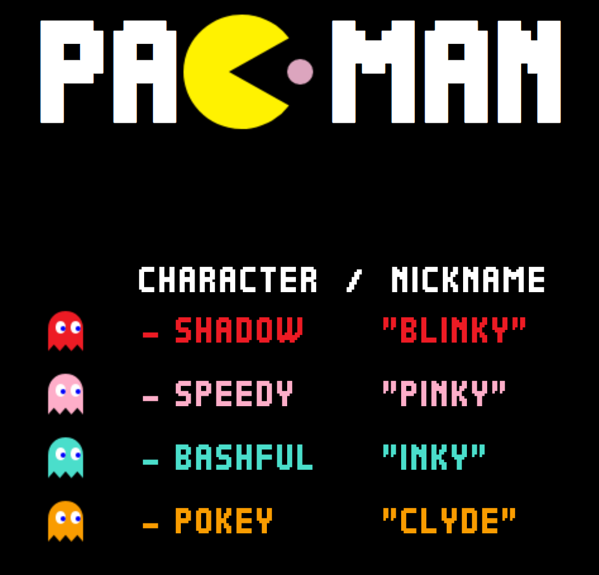
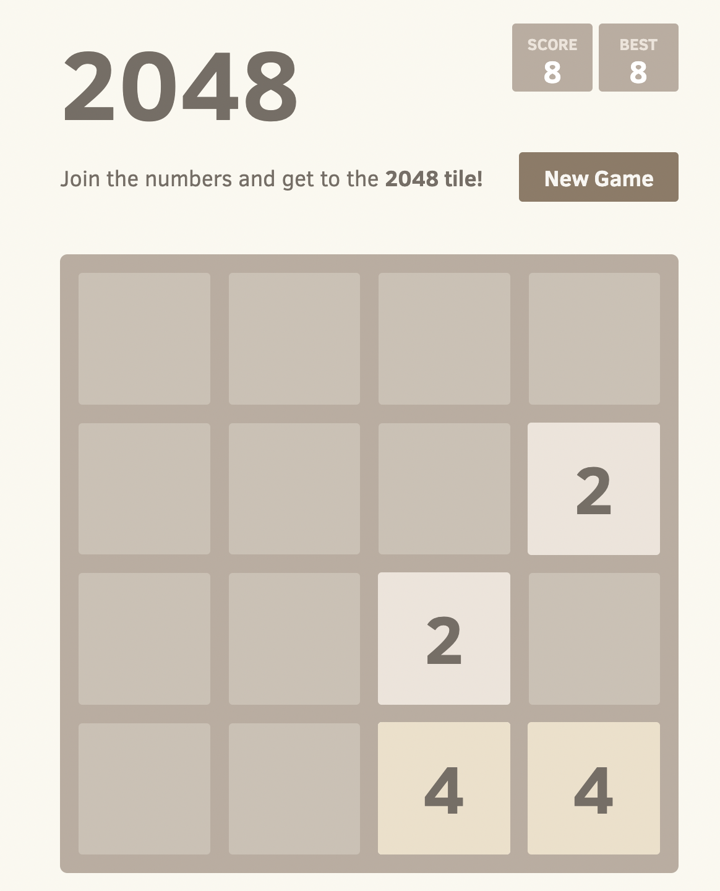

```{r setup, include=FALSE}
options(htmltools.dir.version = FALSE)
knitr::opts_chunk$set(
  fig.width=9, fig.height=3.5, fig.retina=3,
  out.width = "60%",
  cache = FALSE,
  echo = TRUE,
  message = FALSE, 
  warning = FALSE,
  hiline = TRUE
)
```

```{r xaringan-themer, include=FALSE, warning=FALSE}
library(xaringanthemer)
style_duo_accent(
  primary_color = "#000000",
  secondary_color = "#43418A",
  inverse_header_color = "#FFFFFF"
)
# style_duo(primary_color = "#1F4257",
#           secondary_color = "#F97B64")
#style_mono_accent_inverse(base_color = "#3C989E")
#style_mono_accent(base_color = "#43418A")
```

---
# Why R?
.pull-left[
### R is free
### R is popular
### R is powerful
### R is flexible
### R is well-supported
]

--
.pull-right[
### R has a strong community!
```{r, out.width='60%', echo=FALSE, fig.align='bottom', fig.alt="RStats community by Allison Horst: A person in a cape that reads 'code hero' who looks like they are flying through the air while typing on a computer while saying 'I’m doing a think all on my own!' The coder’s arms and legs have ropes attached to two hot air balloons lifting them up, with labels on the balloons including 'teachers', 'bloggers', 'friends', 'developers'. Below the code hero, several people carry a trampoline with labels 'support' and 'community' that will catch them if they fall"}
knitr::include_graphics('https://github.com/allisonhorst/stats-illustrations/raw/master/rstats-artwork/code_hero.jpg')
```
]

---
# Why R?
**R is fun!**

.pull-left[
`beeper::beep(3)`

```{r, out.width='70%', echo=FALSE, fig.alt="beepr: A cartoon alligator running excitedly toward a computer with musical notes coming out of it. Text reads 'beepr::beep()s when your analysis is done running!'"}
knitr::include_graphics('https://github.com/allisonhorst/stats-illustrations/raw/master/rstats-artwork/beepr.jpg')
```
]

.pull-right[
`Rcade::games$Pacman` & `Rcade::games$`2048``

```{r, out.width='30%', echo=FALSE, fig.alt="Pacman from the Rcade package with the four characters, Blinky, Pinky, Inky, and Clyde"}

```

```{r, out.width='20%', echo=FALSE, fig.alt="Rcade package snapshot of the 2048 game"}

```
]

---
# R community
A few global R communities in addition to RFoundation, RForwards, RStudio, and the Rconsortium.

.pull-left[

```{r echo=F, out.width='25%', fig.alt="8 R community logos: rOpenSci, useR, R-Ladies, AfricaR, ArabR, AsiaR, miR, LatinR"}

knitr::include_graphics("https://cdn.shortpixel.ai/spai/w_600+q_lossy+ret_img+to_webp/https://www.numfocus.org/wp-content/uploads/2016/07/ropensci-logo-300.png")

knitr::include_graphics("https://user2021.r-project.org//img/artwork/user-logo-color.png")

#knitr::include_graphics("https://www.r-consortium.org/wp-content/uploads/sites/13/2016/09/RConsortium_Horizontal_Pantone.png")

#knitr::include_graphics("https://community.rstudio.com/uploads/default/original/3X/5/d/5dc960154a129282ba4283771da2fab6fde146fb.png")

knitr::include_graphics("https://community-cdn.rstudio.com/uploads/default/original/3X/e/6/e61d5c8d76feee06efb84f95880e3fc4e12cf269.png")

knitr::include_graphics("https://africa-r.org/author/avatar_hu73f0541d09985efc907138a8670305ca_97180_270x270_fill_lanczos_center_2.png")

knitr::include_graphics("https://arab-r.github.io/ArabR-Website/img/arab-r-logo2.png")

knitr::include_graphics("https://pbs.twimg.com/profile_images/1491075015730954244/pzpN5s2V_400x400.jpg")

knitr::include_graphics("https://mircommunity.com/img/mir_logo_small.png")

knitr::include_graphics("https://github.com/LatinR/latinr/raw/master/man/figures/logo.png")

                        
#"https://www.r-consortium.org/wp-content/uploads/sites/13/2016/09/RConsortium_Horizontal_Pantone.png")

```
]

.pull-right[
```{r out.width='60%', echo=F, fig.alt="RStats community logo again by Allison Horst"}
knitr::include_graphics("https://github.com/allisonhorst/stats-illustrations/raw/master/rstats-artwork/code_hero.jpg")
```
]

--

```{r out.width='50%', echo=F, fig.alt="RUG and RLadies chapter stats"}
knitr::include_graphics("img/202202-rugs-meetup-stats.png")
knitr::include_graphics("img/202202-rladies-meetup-stats.png")
```

---
# We all go through the 'stages of R'

.center[
```{r, out.width='70%', echo=FALSE, fig.align='bottom', fig.alt="R Knowledge Rollercoaster: An illustrated cartoon graph with 'How much I think I know about R' on the y-axis, with axis labels at 'I know nothing' and 'I know lots', versus 'time' on the x-axis. The line varies widely between the two. Above the line are emoji-like faces, showing uncertainty and hope early on. At a second peak is the label 'join R community on twitter', with a 'mind-blown' emoji face. The line quickly descends, but with a happy looking emoji character sliding down it."}
knitr::include_graphics("https://github.com/allisonhorst/stats-illustrations/raw/master/rstats-artwork/r_rollercoaster.png")
```
]

---
# What can you do with R?
#### Data wrangling | knowing about your data
#### Data analysis & summarization | including RStats
#### Data visualization & graphical summaries
#### Reproducible Research
#### Manuscripts, Books, Thesis
#### Interactive web apps
#### Webpages, blogs
#### and more...

---
class: inverse, center, middle

# Getting Started

---

# First steps...
### Install R/RStudio
You are recommended to use the [RStudio IDE](https://www.rstudio.com/products/rstudio/), but you do not have to.

```{r out.width='10%', fig.alt="R programming logo in blue", echo=FALSE}
#knitr::include_graphics("https://upload.wikimedia.org/wikipedia/commons/thumb/1/1b/R_logo.svg/1448px-R_logo.svg.png?20160212050515")
knitr::include_graphics("https://d33wubrfki0l68.cloudfront.net/57299a1dcd979c623325f11bf5e5ce60f3d4eb00/e4602/wp-content/uploads/2018/10/black.png")

```
--

### Install tidyverse and gapminder (data) packages

```{r installation, eval=F, echo=T}
install.packages("tidyverse") # for data wrangling
install.packages("gapminder") # sample dataset
```

```{r echo=FALSE, out.width='10%', fig.alt="tidyverse package hex from RStudio"}
knitr::include_graphics("https://www.rstudio.com/wp-content/uploads/2014/04/tidyverse.png")
```
```{r echo=FALSE, out.width='40%', fig.alt="gapminder logo from website (yellow bordered text) for gapminder package"}
knitr::include_graphics("https://www.gapminder.org/wp-content/themes/gapminder2/images/gapminder-logo.svg")
```


---
# Importing your data
```{r data-import, eval=FALSE, echo=TRUE}
library(tidyverse)
read_csv(file="my_data.csv",
				 col_names=T)		# comma-separated values, as exported from excel/spreadsheets
read_delim(file="my_data.txt", col_names=T,
					 delim="//")	# any delimitter
# Other useful packages
# readxl by Jenny Bryan
read_excel(path="path/to/excel.xls",
					sheet=1,
					range="A1:D50",
					col_names=T)
```

---
# The Gapminder data
.center[
```{r echo=F, out.width='60%', fig.alt="Snapshot of the gapminder data health vs wealth in 2015"}
knitr::include_graphics("https://s3-eu-west-1.amazonaws.com/static.gapminder.org/GapminderMedia/wp-uploads/20161007154225/countries_health_wealth_2016_v71.png")
```
]

---
# Viewing your data

```{r data-str-run, echo=TRUE, eval=T}
library(tidyverse)
gapminder::gapminder 			# Data is in a cleaned up 'tibble' format by default
```

--
```{r eval=F}
str(gapminder)		# Structure of the dataframe
head(gapminder)		# Shows the top few observations (rows) of your data frame
glimpse(gapminder)	# Info-dense summary of the data
```

---
# Viewing your data
**A quick tabulated snapshot**
```{r}
library(knitr)
kable(head(gapminder::gapminder), format = 'html')
```

---
# Viewing your data
**Your full data!**
```{r paged_table, layout="l-body-outset"}
library(rmarkdown)
paged_table(gapminder::gapminder)
```

---
# Viewing your data
**w/ dynamic filtering**
```{r eval=require('DT'), tidy=FALSE}
library(gapminder)
DT::datatable(
  head(gapminder, 1000),
  fillContainer = FALSE, options = list(pageLength = 5))
```

---
# Tidying your data
.center[
```{r echo=F, out.width='70%', fig.alt="There are two sets of anthropomorphized data tables. The top group of three tables are all rectangular and smiling, with a shared speech bubble reading 'our columns are variables and our rows are observations!'. Text to the left of that group reads 'The standard structure of tidy data means that 'tidy datasets are all alike...' The lower group of four tables are all different shapes, look ragged and concerned, and have different speech bubbles reading (from left to right) 'my column are values and my rows are variables', 'I have variables in columns AND in rows', 'I have multiple variables in a single column', and 'I don’t even KNOW what my deal is.' Next to the frazzled data tables is text '...but every messy dataset is messy in its own way. -Hadley Wickham.'"}
knitr::include_graphics("https://github.com/allisonhorst/stats-illustrations/raw/master/rstats-artwork/tidydata_2.jpg")
```
]

---
# Tidying your data
```{r tidyr, echo=TRUE, eval=FALSE}
pivot_longer()  # wide -> long
pivot_wider()   # long -> wide
separate()	    # Separate 1 COLUMN -> many COLUMNS
unite()		      # Unite several COLUMNS -> 1 COLUMN
```

---
# Tidying your data
.center[
```{r echo=F, out.width='40%', fig.alt="GAdenBuie Tidyexplain gif for long to wide data transformation"}
knitr::include_graphics("https://github.com/gadenbuie/tidyexplain/raw/main/images/tidyr-pivoting.gif")
```
]

---
# Tidying your data
.center[
```{r echo=F, out.width='50%', fig.alt="GAdenBuie Tidyexplain gif for gather & spread data transformation"}
knitr::include_graphics("https://github.com/gadenbuie/tidyexplain/raw/main/images/tidyr-spread-gather.gif")
```
]

---
# Wrangling your data
```{r dplyr, echo=TRUE, eval=FALSE}
filter()	# PICK observations by their values | ROWS
select()	# PICK variables by their names | COLUMNS
mutate()	# CREATE new variables w/ functions of existing variables | COLUMNS
transmute()	# COMPUTE 1 or more COLUMNS but drop original columns
arrange()	# REORDER the ROWS
summarize()	# COLLAPSE many values to a single SUMMARY
group_by()	# GROUP data into rows with the same value of variable (COLUMN)
```

---
# Wrangling your data
**w/ filter**
.center[
```{r echo=F, out.width='70%', fig.alt="Allison Horst dply::filter. Cartoon showing three fuzzy monsters either selecting or crossing out rows of a data table. If the type of animal in the table is 'otter' and the site is 'bay', a monster is drawing a purple rectangle around the row. If those conditions are not met, another monster is putting a line through the column indicating it will be excluded. Stylized text reads 'dplyr::filter() - keep rows that satisfy your conditions.'"}
knitr::include_graphics("https://github.com/allisonhorst/stats-illustrations/raw/master/rstats-artwork/dplyr_filter.jpg")
```
]

---
# Wrangling your data
```{r filter1, echo=TRUE, eval=F}
head(gapminder)	# Snapshot of the dataframe
# Now, filter by year and look at only the data from the year 1962
filter(gapminder, year==1962)

# Can be rewritten using "Piping" %>%
gapminder %>%	# Pipe ('then') operator to serially connect operations
	filter(year==1962)
# Filter for China in 2002
gapminder %>%
	filter(year==2002,
				 country=="China")
```

---
# Wrangling your data
```{r filter2, echo=F, eval=T}
gapminder %>%	# Pipe ('then') operator to serially connect operations
	filter(year==1962)
```
***
```{r filter3, echo=F, eval=T}
# Filter for China in 2002
gapminder %>%
	filter(year==2002,
				 country=="China")
```

---
# Math Expressions

You can write LaTeX math expressions inside a pair of dollar signs, e.g. &#36;\alpha+\beta$ renders $\alpha+\beta$. You can use the display style with double dollar signs:

```{}
$$EWCos_{j} = Cos(v_{dis}(S),EWlogFC_{j})$$
```

$$EWCos_{j} = Cos(v_{dis}(S),EWlogFC_{j})$$
--
Check out a math-riddled manuscript written with RMarkdown:
[jravilab.github.io/connectivity_scores](//jravilab.github.io/connectivity_scores)

---

# Visualizing your data
```{r echo=T, eval=F, fig.width=8, fig.height=3}
ggplot(gapminder) +
  aes(x=gdpPercap, y=lifeExp, size=pop, color=country) +
  geom_point(show.legend=FALSE)
```
--
```{r echo=F, eval=T, out.width='60%'}
ggplot(gapminder) +
  aes(x = gdpPercap, y = lifeExp, size = pop, color = country) +
  geom_point(show.legend = FALSE)
```

---
# Visualizing your data
```{r echo=T, eval=F, fig.width=8}
ggplot(gapminder) +
  aes(x=gdpPercap, y=lifeExp, size=pop, color=country) +
  geom_point(show.legend=FALSE) +
  {{facet_wrap(~year)}}
```
```{r echo=F, eval=T, out.width='60%'}
ggplot(gapminder) +
  aes(x = gdpPercap, y = lifeExp, size = pop, color = country) +
  geom_point(show.legend = FALSE) +
  facet_wrap(~year)
```

---
# Visualizing your data
**The code**

```{r gapminder-static1, layout="l-body-outset", echo=TRUE, eval=F}
library(tidyverse)
library(gapminder)
static_plot <- ggplot(gapminder,
                     aes(gdpPercap, lifeExp,
                         size = pop, colour = country)) +
	geom_point(alpha = 0.7, show.legend = FALSE) +
	scale_colour_manual(values = country_colors) +
	scale_size(range = c(2, 12)) +
	scale_x_log10() + theme_minimal() +
	facet_wrap(~continent)
static_plot
```

---
# Visualizing your data
**The plot**

```{r gapminder-static2, layout="l-body-outset", fig.width=6, echo=F, eval=TRUE, message=FALSE, warning=FALSE}
library(tidyverse)
library(gapminder)
static_plot <- ggplot(gapminder,
                     aes(gdpPercap, lifeExp,
                         size = pop, colour = country)) +
	geom_point(alpha = 0.7, show.legend = FALSE) +
	scale_colour_manual(values = country_colors) +
	scale_size(range = c(2, 12)) +
	scale_x_log10() + theme_minimal() +
	facet_wrap(~continent)
static_plot
```

---
# Visualizing your data
**The code**

```{r gapminder-gganimate1, layout="l-body-outset", echo=TRUE, eval=F}
library(gganimate)
ggplot(gapminder,
       aes(gdpPercap, lifeExp,
           size = pop, colour = country)) +
  geom_point(alpha = 0.7, show.legend = FALSE) +
  scale_colour_manual(values = country_colors) +
  scale_size(range = c(2, 12)) +
  scale_x_log10() + theme_minimal() +
  facet_wrap(~continent) +
  # Here comes the gganimate specific bits              #<<
  labs(title = 'Year: {frame_time}', # labels           #<<
       x = 'GDP per capita', y = 'life expectancy') +   #<<
  transition_time(year) + # the dynamic variable        #<<
  ease_aes('linear')                                    #<<
```

---
# Visualizing your data
[**The plot**](https://jananiravi.github.io/workshop-tidyverse/gapminder/workshop-tidyverse-gapminder#gganimate)

```{r gapminder-gganimate2, layout="l-body-outset", out.width='80%', echo=F, eval=T, message=FALSE, warning=FALSE}
library(gganimate); library(tidyverse)
ggplot(gapminder,
       aes(gdpPercap, lifeExp,
           size = pop, colour = country)) +
  geom_point(alpha = 0.7, show.legend = FALSE) +
  scale_colour_manual(values = country_colors) +
  scale_size(range = c(2, 12)) +
  scale_x_log10() + theme_minimal() +
  facet_wrap(~continent) +
  # Here comes the gganimate specific bits          
  labs(title = 'Year: {frame_time}', # labels       
       x = 'GDP per capita', y = 'life expectancy') +
  transition_time(year) + # the dynamic variable     
  ease_aes('linear')                                 

```

---
# Saving your data
```{r ggsave, eval=F, echo=TRUE}
library(tidyverse)
# Save your file name
plot1 <- "gapminder_static_plot.png"

# Save your absolute/relative path
my_full_path <- here("gapminder")

# To save as a tab-delimited text file ...
{{ggsave(filename=plot1, 
       plot=static_plot, 
       device="png",     
       path=my_full_path,
       dpi=300)  }}

```

---
# Have fun w/ programming
.center[
```{r echo=F, out.width='70%', fig.alt="GAdenBuie Tidyexplain gif for long to wide data transformation"}
knitr::include_graphics("https://github.com/allisonhorst/stats-illustrations/raw/master/other-stats-artwork/debugging.jpg")
```
]

---
# Do more with R
.left[
- Draft a **Manuscript** | [jravilab.github.io/connectivity_scores](//jravilab.github.io/connectivity_scores)
- Create a **Website** | [jravilab.github.io](//jravilab.github.io)
- **Present** your data | this one, [jananiravi.github.io/R_intro](//jananiravi.github.io/R_intro)
- Create a **Web application**  | [jravilab.org/molevolvr](http://jravilab.org/molevolvr)
- Write your **Thesis**
- Material: github.com/rladies-eastlansing
]

.right[

```{r echo=F, out.width='20%', fig.alt="You can do it"}
knitr::include_graphics("https://github.com/allisonhorst/stats-illustrations/blob/master/rstats-artwork/r_first_then.png")
#; A digital cartoon with two illustrations: the top shows the R-logo with a scary face, and a small scared little fuzzy monster holding up a white flag in surrender while under a dark stormcloud. The text above says: at first I was like... The lower cartoon is a friendly, smiling R-logo jumping up to give a happy fuzzy monster a high-five under a smiling sun and next to colorful flowers. The text above the bottom illustration reads: but now it's like...
```

]

---
# Acknowledgments
- GARD 2022 | Vangie & Chelsie
- Slides created via the R package [xaringan](https://github.com/yihui/xaringan) built with [remark.js](https://remarkjs.com), [knitr](https://yihui.org/knitr/), and [R Markdown](https://rmarkdown.rstudio.com).
- Cartoons from Allison Horst.
- [JRaviLab](https://jravilab.github.io) | [Krishnan Lab](https://thekrishnanlab.org)
- [R-Ladies East Lansing](https://rladies-eastlansing.github.io) | [Women+ Data SCience](https://women-plus-datascience.github.io) | [AsiaR](//github.com/AsiaR-community)

.pull-left[
### How to reach us
janani@msu.edu | [@jravilab](//twitter.com/jravilab) | [jravilab.github.io](//jravilab.github.io)

You can access all relevant material pertaining to this workshop [here](https://github.com/jananiravi/R_intro).
]

.pull-right[
```{r echo=F, fig.align='right', out.width='40%', fig.alt="Baracktocat, GitHub Octocat with 'Yes we code' election themed poster"}
knitr::include_graphics("https://octodex.github.com/images/baracktocat.jpg")
```
]

---

---

---

```{r eval=F, out.width='100%', fig.height=6, eval=require('leaflet')}
library(leaflet)
leaflet() %>% addTiles() %>% setView(-93.65, 42.0285, zoom = 17)
```
