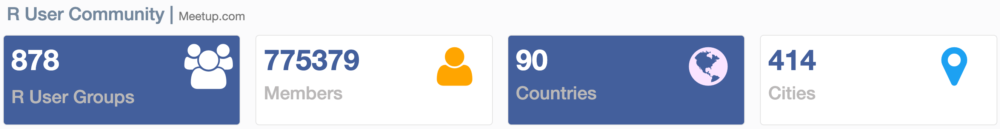
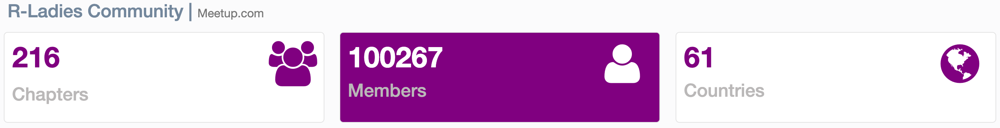

```{r setup, include=FALSE}
options(htmltools.dir.version = FALSE)
knitr::opts_chunk$set(
  fig.width=9, fig.height=3.5, fig.retina=3,
  out.width = "60%",
  cache = FALSE,
  echo = TRUE,
  message = FALSE, 
  warning = FALSE,
  hiline = TRUE
)
```

```{r xaringan-themer, include=FALSE, warning=FALSE}
library(xaringanthemer)
style_duo_accent(
  primary_color = "#000000",
  secondary_color = "#4053BF",
  inverse_header_color = "#FFFFFF"
)
```

background-image: url(https://github.com/jravilab.png)

???

Image credit: [Wikimedia Commons](https://github.com/jravilab.png)

---
class: top

# Why R?
.pull-left[
### R is free
### R is popular
### R is powerful
### R is flexible
### R is well-supported
]

--
.pull-right[
### R has a strong community!
```{r, out.width='60%', echo=FALSE, fig.align='bottom', fig.alt="RStats community by Allison Horst: A person in a cape that reads 'code hero' who looks like they are flying through the air while typing on a computer while saying 'I’m doing a think all on my own!' The coder’s arms and legs have ropes attached to two hot air balloons lifting them up, with labels on the balloons including 'teachers', 'bloggers', 'friends', 'developers'. Below the code hero, several people carry a trampoline with labels 'support' and 'community' that will catch them if they fall"}
knitr::include_graphics('https://github.com/allisonhorst/stats-illustrations/raw/master/rstats-artwork/code_hero.jpg')
```
]

---
# Why R?
.pull-left[
### R is fun!
]

.pull-right[
```{r, out.width='50%', echo=FALSE, fig.align='bottom', fig.alt="beepr: A cartoon alligator running excitedly toward a computer with musical notes coming out of it. Text reads 'beepr::beep()s when your analysis is done running!'"}
knitr::include_graphics('https://github.com/allisonhorst/stats-illustrations/raw/master/rstats-artwork/beepr.jpg')
```
]
---
# R community
A few global R communities in addition to RFoundation, RForwards, RStudio, and the Rconsortium.
.pull-left[

```{r echo=F, out.width='25%', fig.alt="8 R community logos: rOpenSci, useR, R-Ladies, AfricaR, ArabR, AsiaR, miR, LatinR"}

knitr::include_graphics("https://cdn.shortpixel.ai/spai/w_600+q_lossy+ret_img+to_webp/https://www.numfocus.org/wp-content/uploads/2016/07/ropensci-logo-300.png")

knitr::include_graphics("https://user2021.r-project.org//img/artwork/user-logo-color.png")

#knitr::include_graphics("https://www.r-consortium.org/wp-content/uploads/sites/13/2016/09/RConsortium_Horizontal_Pantone.png")

#knitr::include_graphics("https://community.rstudio.com/uploads/default/original/3X/5/d/5dc960154a129282ba4283771da2fab6fde146fb.png")

knitr::include_graphics("https://community-cdn.rstudio.com/uploads/default/original/3X/e/6/e61d5c8d76feee06efb84f95880e3fc4e12cf269.png")

knitr::include_graphics("https://africa-r.org/author/avatar_hu73f0541d09985efc907138a8670305ca_97180_270x270_fill_lanczos_center_2.png")

knitr::include_graphics("https://arab-r.github.io/ArabR-Website/img/arab-r-logo2.png")

knitr::include_graphics("https://pbs.twimg.com/profile_images/1491075015730954244/pzpN5s2V_400x400.jpg")

knitr::include_graphics("https://mircommunity.com/img/mir_logo_small.png")

knitr::include_graphics("https://github.com/LatinR/latinr/raw/master/man/figures/logo.png")

                        
#"https://www.r-consortium.org/wp-content/uploads/sites/13/2016/09/RConsortium_Horizontal_Pantone.png")

```
]

.pull-right[
```{r out.width='70%', echo=F, fig.alt="RStats community logo again by Allison Horst"}
knitr::include_graphics("https://github.com/allisonhorst/stats-illustrations/raw/master/rstats-artwork/code_hero.jpg")
```
]

--

```{r out.width='50%', echo=F, fig.alt="RUG and RLadies chapter stats"}


```

---
# We all go through the 'stages of R'

```{r, out.width='60%', echo=FALSE, fig.align='bottom', fig.alt="R Knowledge Rollercoaster: An illustrated cartoon graph with 'How much I think I know about R' on the y-axis, with axis labels at 'I know nothing' and 'I know lots', versus 'time' on the x-axis. The line varies widely between the two. Above the line are emoji-like faces, showing uncertainty and hope early on. At a second peak is the label 'join R community on twitter', with a 'mind-blown' emoji face. The line quickly descends, but with a happy looking emoji character sliding down it."}
knitr::include_graphics("https://github.com/allisonhorst/stats-illustrations/raw/master/rstats-artwork/r_rollercoaster.png")
```

---
# What can you do with R?
- Data wrangling | knowing about your data
- Data analysis & summarization | including RStats
- Data visualization
- Reproducible Research
- Data visualization & graphical summaries
- Interactive web apps
- and more...

---
class: inverse, center, middle

# Getting Started

---

# First steps...
### Install R/RStudio
You are recommended to use the [RStudio IDE](https://www.rstudio.com/products/rstudio/), but you do not have to.

```{r out.width='10%', fig.alt="R programming logo in blue", echo=FALSE}
#knitr::include_graphics("https://upload.wikimedia.org/wikipedia/commons/thumb/1/1b/R_logo.svg/1448px-R_logo.svg.png?20160212050515")
knitr::include_graphics("https://d33wubrfki0l68.cloudfront.net/57299a1dcd979c623325f11bf5e5ce60f3d4eb00/e4602/wp-content/uploads/2018/10/black.png")

```
--

### Install tidyverse and gapminder (data) packages

```{r installation, eval=F, echo=T}
install.packages("tidyverse") # for data wrangling
install.packages("gapminder") # sample dataset
```

```{r echo=FALSE, out.width='10%', fig.alt="tidyverse package hex from RStudio"}
knitr::include_graphics("https://www.rstudio.com/wp-content/uploads/2014/04/tidyverse.png")
```
```{r echo=FALSE, out.width='40%', fig.alt="gapminder logo from website (yellow bordered text) for gapminder package"}
knitr::include_graphics("https://www.gapminder.org/wp-content/themes/gapminder2/images/gapminder-logo.svg")
```

--

- Create a new R Markdown document from the menu `File -> New File -> R Markdown -> From Template -> Ninja Presentation`;<sup>1</sup>


---
# Data import
```{r data-import, eval=FALSE, echo=TRUE}
library(tidyverse)
read_csv(file="my_data.csv",
				 col_names=T)		# comma-separated values, as exported from excel/spreadsheets
read_delim(file="my_data.txt", col_names=T,
					 delim="//")	# any delimitter
# Other useful packages
# readxl by Jenny Bryan
read_excel(path="path/to/excel.xls",
					sheet=1,
					range="A1:D50",
					col_names=T)
```

---
# The Gapminder data
.center[
```{r echo=F, out.width='60%', fig.alt="Snapshot of the gapminder data health vs wealth in 2015"}
knitr::include_graphics("https://s3-eu-west-1.amazonaws.com/static.gapminder.org/GapminderMedia/wp-uploads/20161007154225/countries_health_wealth_2016_v71.png")
```
]

---
# Viewing your data

```{r data-str-run, echo=TRUE, eval=T}
library(tidyverse)
gapminder::gapminder 			# Data is in a cleaned up 'tibble' format by default
```

--
```{r eval=F}
str(gapminder)		# Structure of the dataframe
head(gapminder)		# Shows the top few observations (rows) of your data frame
glimpse(gapminder)	# Info-dense summary of the data
```

---
# Viewing your data
```{r}
library(knitr)
kable(head(gapminder::gapminder), format = 'html')
```

---
# Viewing your data
```{r paged_table, layout="l-body-outset"}
library(rmarkdown)
paged_table(gapminder::gapminder)
```

---
# Tidy up your data
.center[
```{r echo=F, out.width='70%', fig.alt="There are two sets of anthropomorphized data tables. The top group of three tables are all rectangular and smiling, with a shared speech bubble reading 'our columns are variables and our rows are observations!'. Text to the left of that group reads 'The standard structure of tidy data means that 'tidy datasets are all alike...' The lower group of four tables are all different shapes, look ragged and concerned, and have different speech bubbles reading (from left to right) 'my column are values and my rows are variables', 'I have variables in columns AND in rows', 'I have multiple variables in a single column', and 'I don’t even KNOW what my deal is.' Next to the frazzled data tables is text '...but every messy dataset is messy in its own way. -Hadley Wickham.'"}
knitr::include_graphics("https://github.com/allisonhorst/stats-illustrations/raw/master/rstats-artwork/tidydata_2.jpg")
```
]
---
# Tidy up your data
```{r echo=F, out.width='40%', fig.alt="GAdenBuie Tidyexplain gif for long to wide data transformation"}
knitr::include_graphics("https://github.com/gadenbuie/tidyexplain/raw/main/images/tidyr-pivoting.gif")
```

---
# Tidy up your data
```{r echo=F, out.width='50%', fig.alt="GAdenBuie Tidyexplain gif for gather & spread data transformation"}
knitr::include_graphics("https://github.com/gadenbuie/tidyexplain/raw/main/images/tidyr-spread-gather.gif")
```
---

---
# Filter your data

```{r echo=F, out.width='70%', fig.alt="Allison Horst dply::filter. Cartoon showing three fuzzy monsters either selecting or crossing out rows of a data table. If the type of animal in the table is 'otter' and the site is 'bay', a monster is drawing a purple rectangle around the row. If those conditions are not met, another monster is putting a line through the column indicating it will be excluded. Stylized text reads 'dplyr::filter() - keep rows that satisfy your conditions.'"}
knitr::include_graphics("https://github.com/allisonhorst/stats-illustrations/raw/master/rstats-artwork/dplyr_filter.jpg")
```


---
# remark.js vs xaringan

Some differences between using remark.js (left) and using **xaringan** (right):

.pull-left[
1. Start with a boilerplate HTML file;

1. Plain Markdown;

1. Write JavaScript to autoplay slides;

1. Manually configure MathJax;

1. Highlight code with `*`;

1. Edit Markdown source and refresh browser to see updated slides;
]

.pull-right[
1. Start with an R Markdown document;

1. R Markdown (can embed R/other code chunks);

1. Provide an option `autoplay`;

1. MathJax just works;<sup>*</sup>

1. Highlight code with `{{}}`;

1. The RStudio addin "Infinite Moon Reader" automatically refreshes slides on changes;
]

.footnote[[*] Not really. See next page.]

---

# Math Expressions

You can write LaTeX math expressions inside a pair of dollar signs, e.g. &#36;\alpha+\beta$ renders $\alpha+\beta$. You can use the display style with double dollar signs:

```
$$\bar{X}=\frac{1}{n}\sum_{i=1}^nX_i$$
```

$$\bar{X}=\frac{1}{n}\sum_{i=1}^nX_i$$

Limitations:

1. The source code of a LaTeX math expression must be in one line, unless it is inside a pair of double dollar signs, in which case the starting `$$` must appear in the very beginning of a line, followed immediately by a non-space character, and the ending `$$` must be at the end of a line, led by a non-space character;

1. There should not be spaces after the opening `$` or before the closing `$`.

1. Math does not work on the title slide (see [#61](https://github.com/yihui/xaringan/issues/61) for a workaround).

---

# R Code

```{r comment='#'}
# a boring regression
fit = lm(dist ~ 1 + speed, data = cars)
coef(summary(fit))
dojutsu = c('地爆天星', '天照', '加具土命', '神威', '須佐能乎', '無限月読')
grep('天', dojutsu, value = TRUE)
```

---

# R Plots

```{r cars, eval=FALSE, fig.height=4}
par(mar = c(4, 4, 1, .1))
plot(cars, pch = 19, col = 'darkgray', las = 1)
abline(fit, lwd = 2)
```

---

# Tables

If you want to generate a table, make sure it is in the HTML format (instead of Markdown or other formats), e.g.,

```{r}
knitr::kable(head(iris), format = 'html')
```

---

# HTML Widgets

I have not thoroughly tested HTML widgets against **xaringan**. Some may work well, and some may not. It is a little tricky.

Similarly, the Shiny mode (`runtime: shiny`) does not work. I might get these issues fixed in the future, but these are not of high priority to me. I never turn my presentation into a Shiny app. When I need to demonstrate more complicated examples, I just launch them separately. It is convenient to share slides with other people when they are plain HTML/JS applications.

See the next page for two HTML widgets.

---

```{r out.width='100%', fig.height=6, eval=require('leaflet')}
library(leaflet)
leaflet() %>% addTiles() %>% setView(-93.65, 42.0285, zoom = 17)
```

---

```{r eval=require('DT'), tidy=FALSE}
DT::datatable(
  head(iris, 10),
  fillContainer = FALSE, options = list(pageLength = 8)
)
```

---

# Some Tips


---
# Debugging
```{r echo=F, out.width='50%', fig.alt="GAdenBuie Tidyexplain gif for long to wide data transformation"}
knitr::include_graphics("https://github.com/allisonhorst/stats-illustrations/raw/master/other-stats-artwork/debugging.jpg")
```

---
# Some Tips

When you enable line-highlighting, you can also use the chunk option `highlight.output` to highlight specific lines of the text output from a code chunk. For example, `highlight.output = TRUE` means highlighting all lines, and `highlight.output = c(1, 3)` means highlighting the first and third line.

````md
`r ''````{r, highlight.output=c(1, 3)}
head(iris)
```
````

```{r, highlight.output=c(1, 3), echo=FALSE}
head(iris)
```

Question: what does `highlight.output = c(TRUE, FALSE)` mean? (Hint: think about R's recycling of vectors)

---

# Some Tips

- To make slides work offline, you need to download a copy of remark.js in advance, because **xaringan** uses the online version by default (see the help page `?xaringan::moon_reader`).

- You can use `xaringan::summon_remark()` to download the latest or a specified version of remark.js. By default, it is downloaded to `libs/remark-latest.min.js`.

- Then change the `chakra` option in YAML to point to this file, e.g.

    ```yaml
    output:
      xaringan::moon_reader:
        chakra: libs/remark-latest.min.js
    ```

- If you used Google fonts in slides (the default theme uses _Yanone Kaffeesatz_, _Droid Serif_, and _Source Code Pro_), they won't work offline unless you download or install them locally. The Heroku app [google-webfonts-helper](https://google-webfonts-helper.herokuapp.com/fonts) can help you download fonts and generate the necessary CSS.


---

class: center, middle

# Acknowledgments
- GARD 2022 | Vangie & Chelsie
- Slides created via the R package [**xaringan**](https://github.com/yihui/xaringan) built with [remark.js](https://remarkjs.com), [**knitr**](https://yihui.org/knitr/), and [R Markdown](https://rmarkdown.rstudio.com).
- Cartoons from Allison Horst.
